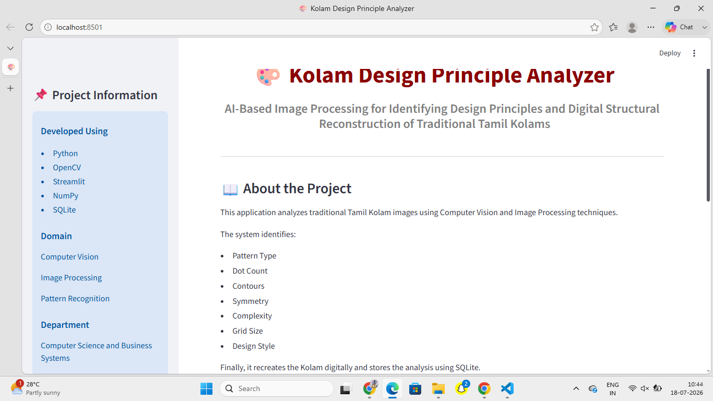
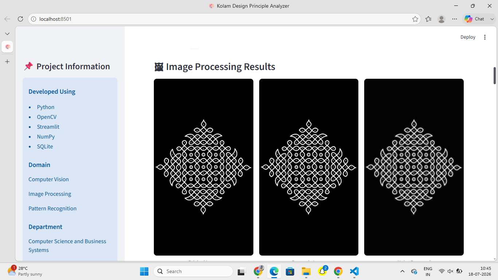
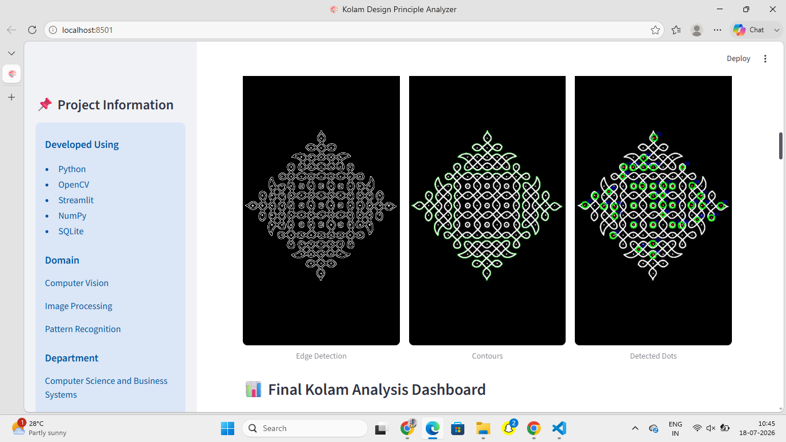
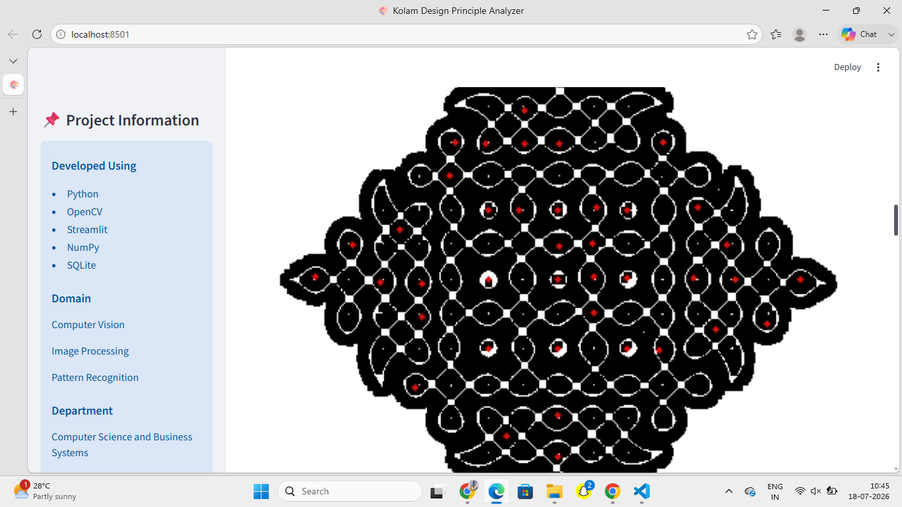
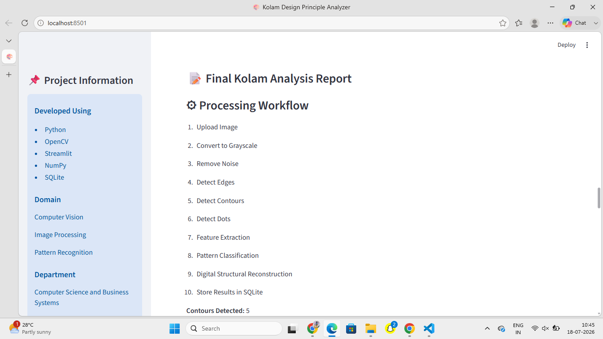
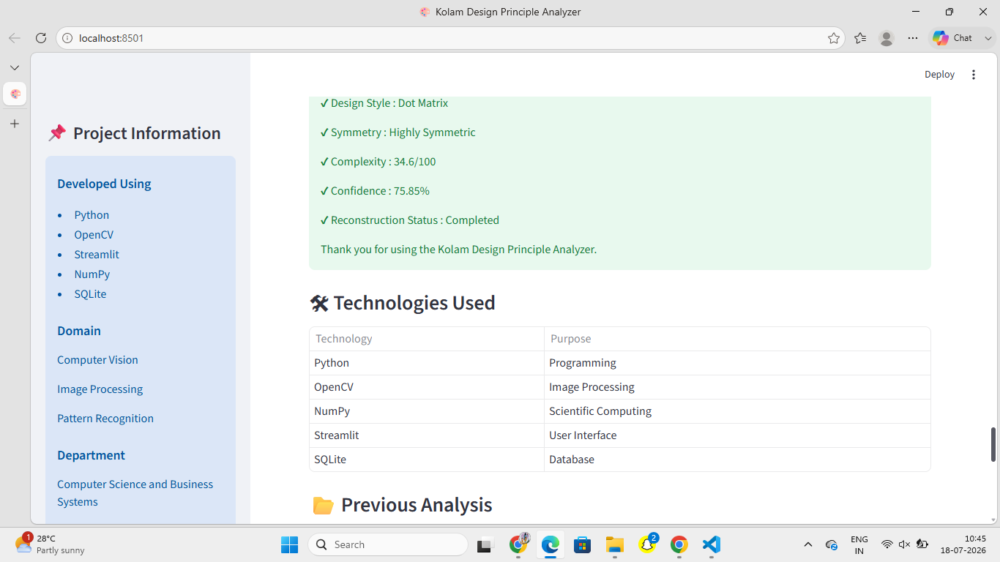

# 🎨 Kolam Design Principle Analyzer

## AI-Based Image Processing for Identifying Design Principles and Digital Structural Reconstruction of Traditional Tamil Kolams

---

## 📌 Project Overview

The **Kolam Design Principle Analyzer** is a Computer Vision and Image Processing application developed using **Python, OpenCV, Streamlit, NumPy, Pandas, and SQLite**. The system analyzes traditional Tamil Kolam images by detecting dots, contours, symmetry, complexity, and design principles. It performs **Digital Structural Reconstruction** and presents the complete analysis through an interactive Streamlit dashboard.

This project helps preserve the traditional Tamil Kolam art using modern Computer Vision techniques.

---

## 🎯 Objectives

* Analyze traditional Tamil Kolam images.
* Detect Kolam dots and contours.
* Identify design principles.
* Estimate symmetry and complexity.
* Classify Kolam patterns.
* Perform Digital Structural Reconstruction.
* Store analysis history using SQLite.
* Display the complete analysis through Streamlit.

---

## ✨ Features

* 📷 Kolam Image Upload
* 🎯 Kolam Region Detection
* ⚫ Dot Detection
* ✂ Edge Detection
* 🔲 Contour Detection
* 📐 Symmetry Analysis
* 🧠 Pattern Classification
* 📊 Complexity Calculation
* 📍 Grid Size Estimation
* 🎨 Digital Structural Reconstruction
* 💾 SQLite Database Storage
* 📈 Interactive Streamlit Dashboard

---

## 🛠 Technologies Used

| Technology | Purpose               |
| ---------- | --------------------- |
| Python     | Programming Language  |
| OpenCV     | Image Processing      |
| Streamlit  | User Interface        |
| NumPy      | Numerical Computation |
| Pandas     | Data Handling         |
| SQLite     | Database Storage      |

---

## 📂 Project Structure

```text
Kolam-Design-Principle-Analyzer/
│
├── app.py
├── image_processing.py
├── feature_extraction.py
├── kolam_recreation.py
├── database.py
├── requirements.txt
├── README.md
├── home.png
├── processing.png
├── contours.png
├── previous analysis.png
└── screenshots/
    ├── reconstruction.png
    ├── workflow.png
    ├── Technologies.png
    └── Analysis visulation.png
```

---

## 🔄 Project Workflow

1. Upload Kolam Image
2. Convert Image to Grayscale
3. Remove Noise
4. Detect Edges
5. Detect Contours
6. Detect Kolam Dots
7. Extract Features
8. Pattern Classification
9. Digital Structural Reconstruction
10. Store Results in SQLite Database

---

## 📊 Analysis Parameters

* Pattern Type
* Dot Count
* Contour Count
* Symmetry Level
* Similarity Score
* Complexity Score
* Grid Pattern
* Design Style
* Drawing Method
* Estimated Drawing Time
* Confidence Score
* Reconstruction Status

---
### 🏠 Home Page


### 🖼 Image Processing Results


### 📐 Contour Detection


### 🎨 Digital Structural Reconstruction


### 📊 Analysis Visualization


### ⚙️ Processing Workflow


### 🛠 Technologies Used


### 📂 Previous Analysis


## ▶️ How to Run

### Clone the Repository

```bash
git clone https://github.com/Mahalakshmi-468/Kolam-Design-Principle-Analyzer.git
```

### Navigate to the Project Folder

```bash
cd Kolam-Design-Principle-Analyzer
```

### Install Dependencies

```bash
pip install -r requirements.txt
```

### Run the Application

```bash
streamlit run app.py
```

---

## 💡 Future Enhancements

* Deep Learning-Based Kolam Recognition
* Automatic Kolam Generation
* Mobile Application
* Real-Time Camera Detection
* Support for Multiple Regional Kolam Styles
* Export Analysis Report as PDF

---

## 👩‍💻 Developed By

**Mahalakshmi M**

**Register Number:** 922524244029

**Department:** Computer Science and Business Systems

**College:** V.S.B Engineering College (Autonomous)

---

## 🙏 Acknowledgement

I sincerely thank the Department of Computer Science and Business Systems, V.S.B Engineering College (Autonomous), for providing continuous guidance, encouragement, and support throughout the development of this project.

---

## 📜 License

This project is developed for academic and educational purposes only.
